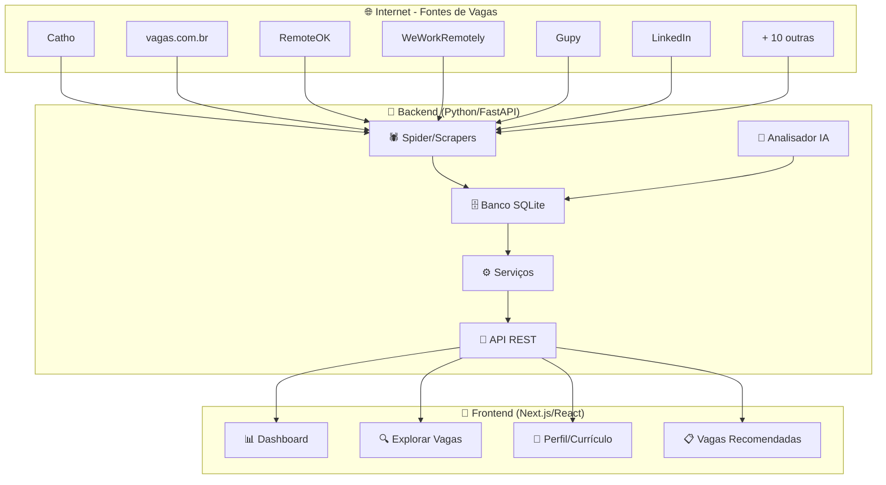
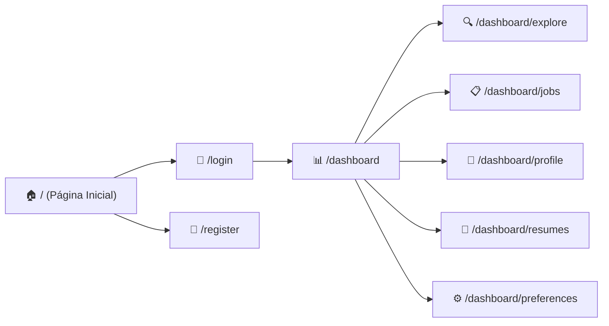
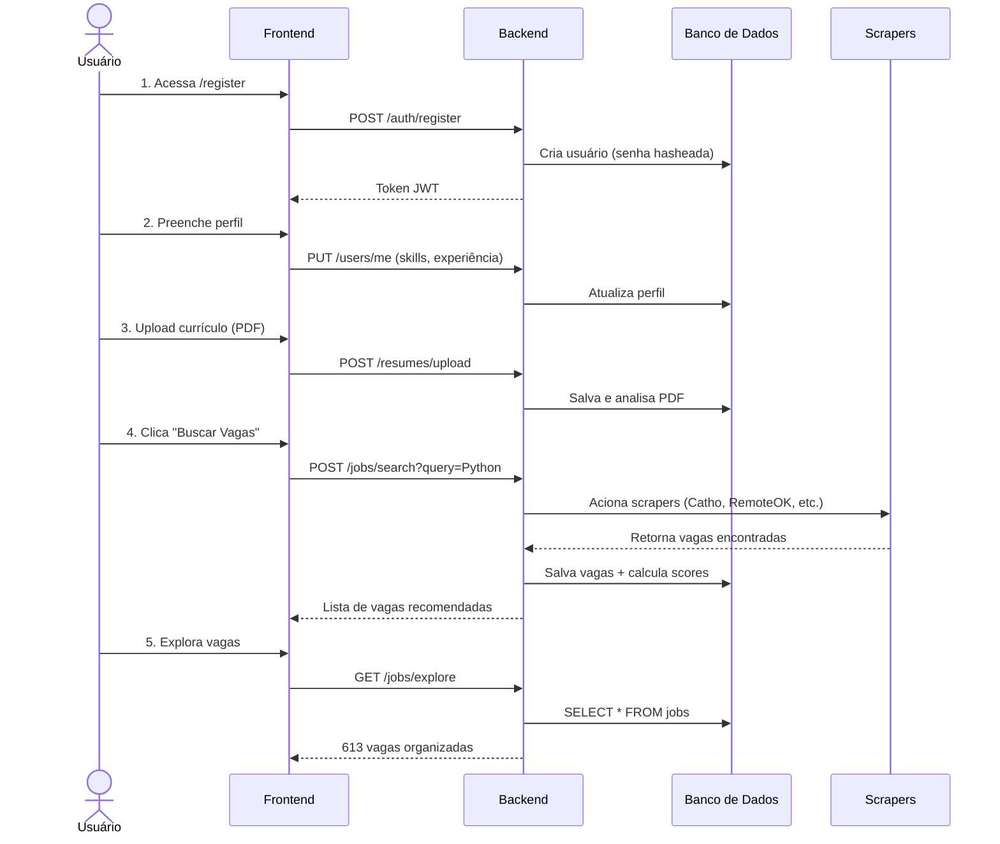
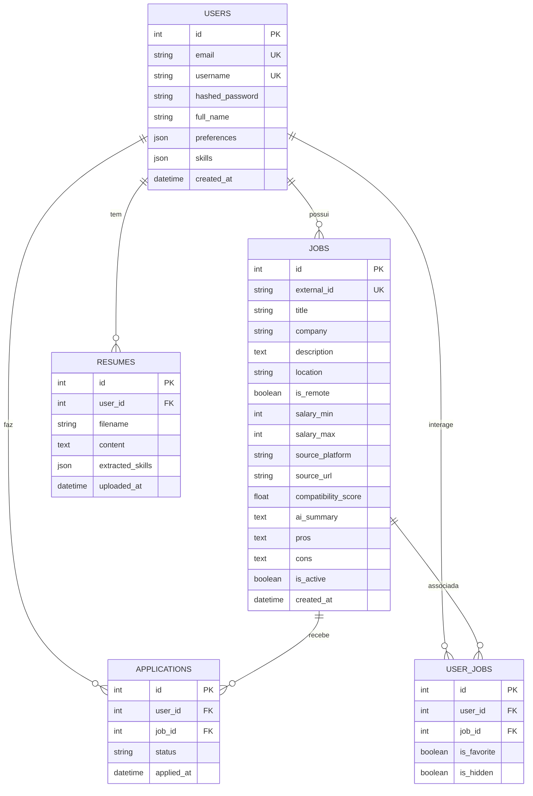

# 📖 Job Hunter AI — Documentação Completa

> **Para quem está aprendendo**: esta documentação explica cada parte do projeto com analogias simples, diagramas visuais e exemplos práticos. Pense nela como um "mapa do tesouro" que guia você por todo o sistema.

---

## 📑 Índice

1. [O que é o Job Hunter AI?](#1-o-que-é-o-job-hunter-ai)
2. [Visão Geral da Arquitetura](#2-visão-geral-da-arquitetura)
3. [Stack Tecnológica](#3-stack-tecnológica)
4. [Estrutura de Pastas](#4-estrutura-de-pastas)
5. [Backend — O Cérebro do Sistema](#5-backend--o-cérebro-do-sistema)
6. [Frontend — A Interface Visual](#6-frontend--a-interface-visual)
7. [Fluxos Principais](#7-fluxos-principais)
8. [Banco de Dados](#8-banco-de-dados)
9. [Scrapers — Os Coletores de Vagas](#9-scrapers--os-coletores-de-vagas)
10. [Deploy e Infraestrutura](#10-deploy-e-infraestrutura)
11. [Como Rodar Localmente](#11-como-rodar-localmente)
12. [Glossário](#12-glossário)

---

## 1. O que é o Job Hunter AI?

O **Job Hunter AI** é uma aplicação completa que **automatiza a busca por vagas de emprego**. Imagine ter um assistente pessoal que:

- 🕷️ **Coleta vagas** automaticamente de +15 plataformas (Catho, LinkedIn, RemoteOK, etc.)
- 🤖 **Analisa vagas com IA** para calcular compatibilidade com seu perfil
- 📄 **Gerencia seus currículos** e extrai informações automaticamente
- 🔍 **Busca inteligente** dentro de todas as vagas coletadas
- 📊 **Dashboard visual** com estatísticas e recomendações personalizadas

> **Analogia**: pense no sistema como uma "fábrica de busca de emprego" com três partes:
> - **Scrapers** = os operários que saem coletando vagas pela internet
> - **Backend** = o gerente que organiza, analisa e armazena tudo
> - **Frontend** = o escritório bonito onde você visualiza os resultados

---

## 2. Visão Geral da Arquitetura



### Como as peças se encaixam?

| Camada | O que faz | Tecnologia |
|--------|-----------|------------|
| **Frontend** | Interface visual para o usuário | Next.js 14 + React + TailwindCSS |
| **Backend API** | Recebe pedidos do frontend e responde com dados | FastAPI (Python) |
| **Serviços** | Lógica de negócio (buscar, analisar, pontuar) | Python puro |
| **Scrapers** | Coleta vagas de sites externos | httpx + BeautifulSoup |
| **Banco de Dados** | Armazena vagas, usuários, currículos | SQLite + SQLAlchemy |
| **IA** | Analisa vagas e calcula compatibilidade | OpenAI / análise local |

---

## 3. Stack Tecnológica

### Backend (Python)

| Tecnologia | Para que serve | Analogia simples |
|-----------|----------------|------------------|
| **FastAPI** | Framework web (cria a API) | O "garçom" que recebe pedidos e traz respostas |
| **SQLAlchemy** | ORM (fala com o banco de dados) | O "tradutor" entre Python e SQL |
| **Pydantic** | Validação de dados | O "inspetor" que verifica se os dados estão corretos |
| **httpx** | Cliente HTTP assíncrono | O "mensageiro" que busca dados na internet |
| **BeautifulSoup** | Parser de HTML | O "leitor" que entende páginas web |
| **passlib** | Criptografia de senhas | O "cofre" que protege as senhas |
| **jose (JWT)** | Tokens de autenticação | O "crachá" que identifica quem está logado |
| **jobspy** | Biblioteca de busca de vagas | Um "atalho" para buscar em várias plataformas |

### Frontend (TypeScript/React)

| Tecnologia | Para que serve | Analogia simples |
|-----------|----------------|------------------|
| **Next.js 14** | Framework React com SSR | A "estrutura" da casa (paredes, teto, piso) |
| **React** | Biblioteca de UI | Os "tijolos" que montam cada peça da tela |
| **TailwindCSS** | Estilização (CSS utilitário) | A "tinta e decoração" da casa |
| **TanStack Query** | Gerenciamento de dados da API | O "carteiro" que busca e cacheia dados |
| **Zustand** | Estado global da aplicação | A "memória compartilhada" entre telas |
| **Axios** | Cliente HTTP | O "telefone" que liga para o backend |
| **Shadcn/ui** | Componentes visuais prontos | "Móveis pré-fabricados" bonitos |
| **Lucide React** | Ícones | Os "emojis" profissionais da interface |

---

## 4. Estrutura de Pastas

```
job-hunter-ai/
├── 📁 apps/
│   ├── 📁 backend/              ← 🐍 Todo o código Python
│   │   ├── 📁 app/
│   │   │   ├── 📁 api/          ← Endpoints da API (rotas HTTP)
│   │   │   │   ├── deps.py      ← Dependências compartilhadas
│   │   │   │   └── 📁 v1/       ← Versão 1 da API
│   │   │   │       ├── auth.py        ← Login/Registro
│   │   │   │       ├── 📁 jobs/       ← Rotas de vagas
│   │   │   │       │   ├── explore.py ← 🔍 Explorar vagas brutas
│   │   │   │       │   ├── search.py  ← Buscar vagas novas
│   │   │   │       │   └── ...
│   │   │   │       ├── resumes.py     ← Upload de currículos
│   │   │   │       ├── users.py       ← Perfil do usuário
│   │   │   │       └── stats.py       ← Estatísticas
│   │   │   ├── 📁 core/         ← Configurações centrais
│   │   │   │   ├── config.py    ← Variáveis de ambiente
│   │   │   │   └── security.py  ← Hashing de senhas + JWT
│   │   │   ├── 📁 crud/         ← Operações no banco de dados
│   │   │   ├── 📁 models/       ← Modelos do banco (tabelas)
│   │   │   │   ├── user.py      ← Tabela de usuários
│   │   │   │   ├── job.py       ← Tabela de vagas
│   │   │   │   ├── resume.py    ← Tabela de currículos
│   │   │   │   └── ...
│   │   │   ├── 📁 schemas/      ← Schemas Pydantic (validação)
│   │   │   ├── 📁 services/     ← Lógica de negócio
│   │   │   │   ├── 📁 scrapers/ ← Coletores de vagas
│   │   │   │   ├── 📁 jobsearch/← Sistema Spider (coleta em massa)
│   │   │   │   ├── job_service.py    ← Serviço principal de vagas
│   │   │   │   ├── scoring_service.py← Pontuação de compatibilidade
│   │   │   │   └── analyzer.py       ← Análise com IA
│   │   │   ├── database.py      ← Conexão com o banco
│   │   │   └── main.py          ← 🚀 Ponto de entrada da API
│   │   ├── .env.local           ← Variáveis de ambiente (secretas)
│   │   └── requirements.txt     ← Dependências Python
│   │
│   └── 📁 frontend/             ← ⚛️ Todo o código React/Next.js
│       └── 📁 src/
│           ├── 📁 app/           ← Páginas (App Router)
│           │   ├── page.tsx           ← Página inicial (redireciona)
│           │   ├── layout.tsx         ← Layout global
│           │   ├── 📁 login/         ← Tela de login
│           │   ├── 📁 register/      ← Tela de registro
│           │   └── 📁 dashboard/     ← Área logada
│           │       ├── page.tsx       ← 📊 Dashboard principal
│           │       ├── 📁 explore/    ← 🔍 Explorar vagas brutas
│           │       ├── 📁 jobs/       ← 📋 Lista de vagas
│           │       ├── 📁 preferences/← ⚙️ Preferências
│           │       ├── 📁 profile/    ← 👤 Perfil
│           │       └── 📁 resumes/    ← 📄 Currículos
│           ├── 📁 components/   ← Componentes reutilizáveis
│           │   ├── recommended-jobs.tsx  ← Vagas recomendadas
│           │   ├── job-card.tsx          ← Card de vaga
│           │   ├── preferences-form.tsx  ← Formulário de preferências
│           │   ├── profile-form.tsx      ← Formulário de perfil
│           │   └── 📁 ui/               ← Componentes base (shadcn)
│           ├── 📁 lib/           ← Utilitários
│           │   └── api.ts        ← Configuração do Axios
│           ├── 📁 providers/     ← Provedores React
│           └── 📁 store/         ← Estado global (Zustand)
│               └── user-store.ts ← Estado do usuário logado
│
├── 📁 scripts/               ← Scripts auxiliares
├── 📁 docker/                ← Configurações Docker
├── docker-compose.yml        ← Docker para desenvolvimento
├── docker-compose.vps.yml    ← Docker para produção (VPS)
└── Makefile                  ← Atalhos de comandos
```

---

## 5. Backend — O Cérebro do Sistema

### 5.1 Arquitetura em Camadas

O backend segue o padrão de **arquitetura em camadas** (layered architecture). Pense nisso como um prédio de andares:

```
┌─────────────────────────────────────┐
│   📡 API (Rotas/Endpoints)          │  ← Andar 4: Recebe pedidos HTTP
│   Recebe requisições e devolve JSON  │
├─────────────────────────────────────┤
│   📋 Schemas (Pydantic)             │  ← Andar 3: Valida os dados
│   Garante que dados estão corretos   │
├─────────────────────────────────────┤
│   ⚙️ Services (Lógica de Negócio)   │  ← Andar 2: Onde a mágica acontece
│   Busca, analisa, pontua vagas       │
├─────────────────────────────────────┤
│   🗄️ Models + CRUD (Banco de Dados) │  ← Andar 1: Armazena tudo
│   Tabelas SQL + operações CRUD       │
└─────────────────────────────────────┘
```

> **Por que camadas?** Cada andar tem uma responsabilidade clara. Se você precisa mudar como vagas são salvas, só mexe no andar 1. Se precisa mudar uma regra de negócio, só mexe no andar 2. Isso evita que uma mudança quebre o sistema inteiro.

### 5.2 Endpoints da API

A API segue o padrão **REST** com versionamento (`/api/v1/...`):

| Método | Rota | O que faz |
|--------|------|-----------|
| `POST` | `/api/v1/auth/register` | Cria uma nova conta |
| `POST` | `/api/v1/auth/login` | Faz login e retorna JWT token |
| `GET` | `/api/v1/users/me` | Retorna dados do usuário logado |
| `PUT` | `/api/v1/users/me` | Atualiza perfil e preferências |
| `POST` | `/api/v1/jobs/search` | Busca vagas novas em plataformas |
| `GET` | `/api/v1/jobs/recommended` | Retorna vagas recomendadas pela IA |
| `GET` | `/api/v1/jobs/explore` | 🆕 Explora TODAS as vagas brutas |
| `POST` | `/api/v1/resumes/upload` | Faz upload de currículo (PDF) |
| `GET` | `/api/v1/stats` | Estatísticas do dashboard |

### 5.3 Fluxo de uma Requisição

Vamos acompanhar o que acontece quando você acessa a página **Explorar Vagas**:

```
1. Usuário abre /dashboard/explore no navegador
   │
2. Frontend faz GET /api/v1/jobs/explore?limit=30&offset=0
   │
3. FastAPI recebe a requisição
   │
4. O endpoint explore.py é executado:
   │   ├── Monta query SQL com filtros
   │   ├── Consulta banco: SELECT * FROM jobs WHERE ...
   │   ├── Conta total de vagas
   │   ├── Agrupa por plataforma (para badges)
   │   └── Conta vagas remotas
   │
5. Retorna JSON com jobs[], total, platforms[], has_more
   │
6. Frontend recebe os dados e renderiza os cards
```

### 5.4 Autenticação (JWT)

A autenticação funciona assim (como um "crachá digital"):

```
┌──────────┐                      ┌──────────┐
│ Frontend │                      │ Backend  │
└────┬─────┘                      └────┬─────┘
     │                                 │
     │  POST /auth/login               │
     │  { email, password }            │
     │ ──────────────────────────────> │
     │                                 │  1. Verifica senha
     │                                 │  2. Gera JWT token
     │  { access_token: "eyJhb..." }   │
     │ <────────────────────────────── │
     │                                 │
     │  GET /jobs/recommended          │
     │  Header: Authorization: Bearer eyJhb...
     │ ──────────────────────────────> │
     │                                 │  3. Valida token
     │                                 │  4. Identifica usuário
     │  { jobs: [...] }                │
     │ <────────────────────────────── │
```

> **O que é JWT?** É como um crachá digital criptografado. Contém o ID do usuário e uma assinatura que prova que o backend o emitiu. Cada requisição autenticada envia esse crachá no cabeçalho HTTP.

### 5.5 Segurança de Senhas

As senhas **nunca são salvas em texto puro**. Elas passam por um processo chamado **hashing**:

```python
# Senha do usuário: "minha_senha123"
# 
# Hash salvo no banco:
# "$pbkdf2-sha256$29000$abc123...xyz789"
#
# É IMPOSSÍVEL reverter o hash para descobrir a senha original!
```

O sistema suporta dois algoritmos:
- **pbkdf2_sha256** — para novos usuários
- **bcrypt** — compatibilidade com usuários antigos

---

## 6. Frontend — A Interface Visual

### 6.1 Páginas da Aplicação



| Página | Descrição |
|--------|-----------|
| **Dashboard** | Visão geral: stats, vagas recomendadas, ações rápidas |
| **Explorar Vagas** | Grid com TODAS as vagas brutas do banco, busca e filtros |
| **Vagas** | Lista de vagas encontradas com busca avançada |
| **Perfil** | Informações pessoais e profissionais |
| **Currículos** | Upload e gestão de PDFs de currículo |
| **Preferências** | Tecnologias, salário desejado, tipo de trabalho |

### 6.2 Componentes Principais

Cada componente é como uma **peça de LEGO** reutilizável:

| Componente | O que renderiza | Arquivo |
|-----------|-----------------|---------|
| `RecommendedJobs` | Cards de vagas recomendadas com score | `recommended-jobs.tsx` |
| `JobCard` | Um cartão individual de vaga | `job-card.tsx` |
| `PreferencesForm` | Formulário completo de preferências | `preferences-form.tsx` |
| `ProfileForm` | Formulário de perfil do usuário | `profile-form.tsx` |
| `ResumeProfileCard` | Card resumo do currículo | `resume-profile-card.tsx` |
| `PreferencesPrompt` | Popup sugerindo preencher preferências | `preferences-prompt.tsx` |

### 6.3 Gerenciamento de Estado

O frontend usa duas estratégias para dados:

```
┌──────────────────────────────────────────┐
│          Estado do Frontend              │
├──────────────────┬───────────────────────┤
│  📦 Zustand      │  🔄 TanStack Query    │
│  (Estado local)  │  (Dados do servidor)  │
├──────────────────┼───────────────────────┤
│ • Usuário logado │ • Lista de vagas      │
│ • Token JWT      │ • Currículos          │
│ • Preferências   │ • Estatísticas        │
│   de UI          │ • Recomendações       │
└──────────────────┴───────────────────────┘
```

> **Zustand** = memória do navegador (rápido, não faz requisição)
> **TanStack Query** = busca dados do backend, cacheia, revalida automaticamente

### 6.4 Página Explorar Vagas — Detalhamento

Esta é a feature mais recente. Veja como funciona:

```
┌─────────────────────────────────────────────────────┐
│  🔍 Explorar Vagas Brutas                           │
├─────────────────────────────────────────────────────┤
│                                                     │
│  ┌─────────┐ ┌─────────┐ ┌─────────┐ ┌─────────┐  │
│  │613 Total│ │140 Remot│ │6 Plataf │ │30 Exib  │  │
│  └─────────┘ └─────────┘ └─────────┘ └─────────┘  │
│                                                     │
│  🔎 [___Pesquise por cargo, empresa..._________]   │
│                                                     │
│  Filtrar: 🏠Remoto(140) [Todas] [catho(256)]       │
│           [vagas.com.br(151)] [remoteok(57)] ...    │
│                                                     │
│  ┌──────────────────┐  ┌──────────────────┐        │
│  │ Work From Home   │  │ Estágio Eng.     │        │
│  │ DevOps           │  │ Pré-Vendas       │        │
│  │ 🌐 catho         │  │ 🌐 catho         │        │
│  │ Ver Vaga →       │  │ Ver Vaga →       │        │
│  └──────────────────┘  └──────────────────┘        │
│                                                     │
│  ⬇️ Scroll para carregar mais... (infinite scroll)  │
└─────────────────────────────────────────────────────┘
```

**Funcionalidades**:
- **Busca com debounce** — espera 400ms depois que você para de digitar
- **Filtro por plataforma** — clique nos badges coloridos
- **Toggle remoto** — mostra só vagas remotas
- **Infinite scroll** — carrega mais vagas ao rolar para baixo
- **Cards responsivos** — grid 1/2/3 colunas conforme a tela

---

## 7. Fluxos Principais

### 7.1 Fluxo: Novo Usuário (do zero até vagas)



### 7.2 Fluxo: Spider (Coleta em Massa)

O **Spider** é o sistema que roda por horas coletando milhares de vagas:

```
🕷️ Spider inicia
    │
    ├── 1. Catho Scraper
    │   ├── Busca "Python developer"
    │   ├── Busca "Data Engineer"
    │   └── Busca "React developer" ... (256 vagas)
    │
    ├── 2. vagas.com.br Scraper
    │   └── (151 vagas)
    │
    ├── 3. WeWorkRemotely Scraper
    │   └── (103 vagas)
    │
    ├── 4. RemoteOK Scraper
    │   └── (57 vagas)
    │
    ├── 5. Gupy Scraper
    │   └── (42 vagas)
    │
    └── ... mais scrapers
    
Total: 613 vagas coletadas! ✅
Todas salvas no banco com deduplicação por external_id
```

### 7.3 Fluxo: Busca e Relevância

Quando você pesquisa "python" na página Explorar:

```
Entrada: q="python"
    │
    ├── 1. WHERE title ILIKE '%python%'         → peso 3 (mais relevante)
    ├── 2. WHERE company ILIKE '%python%'       → peso 2
    ├── 3. WHERE description ILIKE '%python%'   → peso 1
    └── 4. WHERE location ILIKE '%python%'      → peso 1
    
Resultado: vagas com "Python" no TÍTULO aparecem primeiro!
           97 vagas encontradas, ordenadas por relevância
```

---

## 8. Banco de Dados

### 8.1 Diagrama de Tabelas



### 8.2 Campos Importantes da Tabela `jobs`

| Campo | Tipo | Descrição |
|-------|------|-----------|
| `external_id` | String | ID único da vaga na plataforma original. Evita duplicatas! |
| `source_platform` | String | De onde veio: "catho", "remoteok", "gupy", etc. |
| `compatibility_score` | Float | 0-100: quão compatível a vaga é com seu perfil |
| `is_remote` | Boolean | Se a vaga é remota |
| `pros` / `cons` | JSON | Prós e contras analisados por IA |
| `extracted_technologies` | JSON | Tecnologias detectadas na descrição |

---

## 9. Scrapers — Os Coletores de Vagas

### 9.1 Lista de Scrapers

O sistema tem **dois conjuntos** de scrapers:

#### Scrapers Individuais (`services/scrapers/`)
Usados para busca sob demanda quando o usuário clica "Buscar Vagas":

| Scraper | Plataforma | Tipo |
|---------|-----------|------|
| `catho_scraper.py` | Catho | Vagas BR nacionais |
| `vagas_scraper.py` | vagas.com.br | Vagas BR nacionais |
| `gupy_scraper.py` | Gupy | Vagas BR tech |
| `remoteok.py` | RemoteOK | Vagas remotas internacionais |
| `adzuna_scraper.py` | Adzuna | Agregador internacional |
| `jobspy_scraper.py` | LinkedIn/Indeed via JobSpy | Multi-plataforma |
| `remote_scrapers.py` | WeWorkRemotely + outros | Vagas remotas |
| `freelance_scrapers.py` | 99Freelas, Workana | Freelance |
| `ti_brasil_scrapers.py` | Coodesh, GeekHunter, etc. | Tech BR |

#### Spider (`services/jobsearch/`)
Sistema de **coleta em massa** que roda por horas:

| Módulo | Plataformas |
|--------|------------|
| `spider.py` | Orquestrador principal — gerencia todos os scrapers |
| `cathoscraper.py` | Catho (versão otimizada para volume) |
| `remoteok.py` | RemoteOK |
| `weworkremotely.py` | WeWorkRemotely |
| `gupy.py` | Gupy |
| `remotar.py` | Remotar |
| `geekhunter.py` | GeekHunter |
| `programathor.py` | ProgramaThor |
| `coodesh.py` | Coodesh |
| `workana.py` | Workana |
| `apinfo.py` | APInfo |
| `adzuna.py` | Adzuna |

### 9.2 Como um Scraper Funciona

```python
# Exemplo simplificado de como funciona o scraper da Catho:

class CathoScraper:
    async def search(self, query: str) -> list[RawJob]:
        # 1. Monta a URL de busca
        url = f"https://www.catho.com.br/vagas/{query}"

        # 2. Faz a requisição HTTP (como se fosse um navegador)
        response = await httpx.get(url, headers={"User-Agent": "..."})

        # 3. Parseia o HTML da página
        soup = BeautifulSoup(response.text, "html.parser")

        # 4. Extrai dados de cada vaga
        jobs = []
        for card in soup.select(".job-card"):
            jobs.append(RawJob(
                title=card.select_one(".title").text,
                company=card.select_one(".company").text,
                url=card.select_one("a")["href"],
                ...
            ))

        return jobs  # Retorna lista de vagas brutas
```

### 9.3 Deduplicação

Cada vaga recebe um `external_id` único baseado na URL + plataforma. Se o scraper encontrar a mesma vaga duas vezes, o banco rejeita a duplicata:

```python
external_id = f"catho_{hash('url_da_vaga')}"
# Se já existe no banco → ignora (não duplica)
```

---

## 10. Deploy e Infraestrutura

### 10.1 Desenvolvimento Local

```
┌──────────────────────────────────────┐
│  Seu computador (localhost)          │
│                                      │
│  Frontend → http://localhost:3000    │
│  Backend  → http://localhost:8000    │
│  Banco    → local_database/app.db   │
└──────────────────────────────────────┘
```

### 10.2 Produção (VPS)

```
┌───────────────────────────────────────────┐
│  VPS (Servidor na nuvem)                  │
│                                           │
│  ┌────────┐                               │
│  │ Nginx  │ ← Proxy reverso (porta 80)    │
│  └───┬────┘                               │
│      │                                    │
│  ┌───┴────────────────────────────┐       │
│  │  Docker Compose                │       │
│  │  ┌──────────┐  ┌───────────┐  │       │
│  │  │ Frontend │  │ Backend   │  │       │
│  │  │ :3000    │  │ :8000     │  │       │
│  │  └──────────┘  └───────────┘  │       │
│  │  ┌──────────────────────────┐ │       │
│  │  │ SQLite (volume Docker)   │ │       │
│  │  └──────────────────────────┘ │       │
│  └────────────────────────────────┘       │
└───────────────────────────────────────────┘
```

---

## 11. Como Rodar Localmente

### Pré-requisitos
- **Python 3.11+** instalado
- **Node.js 18+** instalado
- **Git** instalado

### Passo a Passo

```bash
# 1. Clone o repositório
git clone <url-do-repo>
cd job-hunter-ai

# 2. Backend
cd apps/backend
python -m venv venv                    # Cria ambiente virtual
venv\Scripts\activate                  # Ativa (Windows)
pip install -r requirements.txt        # Instala dependências
cp .env.example .env.local             # Copia config
python -m uvicorn app.main:app --reload --port 8000  # Roda!

# 3. Frontend (outro terminal)
cd apps/frontend
npm install                            # Instala dependências
cp .env.example .env.local             # Copia config
npm run dev                            # Roda na porta 3000!
```

### Acessar
- **Frontend**: http://localhost:3000
- **API Docs**: http://localhost:8000/docs (Swagger)
- **Health Check**: http://localhost:8000/health

---

## 12. Glossário

| Termo | Significado |
|-------|-------------|
| **API** | Interface de Programação de Aplicações — como o frontend "conversa" com o backend |
| **Backend** | Parte do sistema que roda no servidor (Python) |
| **Frontend** | Parte do sistema que roda no navegador (React) |
| **Scraper** | Programa que coleta dados de websites automaticamente |
| **Spider** | Sistema que gerencia múltiplos scrapers para coleta em massa |
| **JWT** | JSON Web Token — token de autenticação (como um crachá) |
| **ORM** | Object-Relational Mapping — traduz Python ↔ SQL |
| **Endpoint** | Uma URL específica da API (ex: `/api/v1/jobs/explore`) |
| **Schema** | Definição da estrutura que os dados devem ter |
| **CRUD** | Create, Read, Update, Delete — as 4 operações básicas |
| **Hashing** | Processo de transformar senha em texto irreversível |
| **Debounce** | Técnica que espera o usuário parar de digitar antes de buscar |
| **Infinite Scroll** | Carrega mais dados conforme o usuário rola a página |
| **Deploy** | Publicar a aplicação em um servidor para acesso público |
| **Monorepo** | Repositório único contendo vários projetos (frontend + backend) |
| **SSR** | Server-Side Rendering — renderização no servidor (Next.js) |
| **Query Key** | Identificador único usado pelo TanStack Query para cachear dados |

---

> 📝 **Documentação gerada em**: Março 2026
> 🔧 **Versão do projeto**: Job Hunter AI v1.0
> 📊 **Total de vagas coletadas**: 613 vagas de 6 plataformas diferentes
